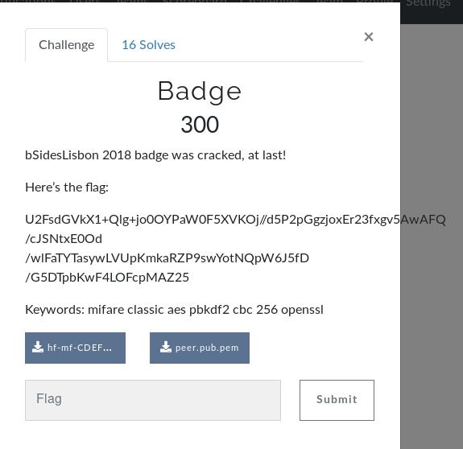

# Badge

 In this challenge, the goal is simple, decrypt the flag that is given in the initial boot of the challenge. 

> U2FsdGVkX1+Qlg+jo0OYPaW0F5XVKOj//d5P2pGgzjoxEr23fxgv5AwAFQ/cJSNtxE0Od/wlFaTYTasywLVUpKmkaRZP9swYotNQpW6J5fD/G5DTpbKwF4LOFcpMAZ25

## Inital Analysis

The files [hf-md-CDEF213E-data.bin](Files/hf-mf-CDEF213E-data.bin) and [peer.pub.pem](Files/peer.pub.pem) are given, along with a string that they claim is encrypted with a certain secret (and is the flag we need).

> U2FsdGVkX1+Qlg+jo0OYPaW0F5XVKOj//d5P2pGgzjoxEr23fxgv5AwAFQ/cJSNtxE0Od/wlFaTYTasywLVUpKmkaRZP9swYotNQpW6J5fD/G5DTpbKwF4LOFcpMAZ25

## Development

After analysing the files, we come to the conclusion that we can use tools to extract data from the hf-mf file, since it's a Mifare card.

The main tool above mentined is named mfdread and can be found in:

> https://github.com/zhovner/mfdread

We get the private key (exfiltrated before from the hf-md file), and the downloaded public key (file peer.pub.pem) which we can then do a command to get the shared_key secret.

> openssl pkeyutl -derive -inkey bob.private.pem -peerkey alice.public.pem -out shared_secret_bob.bin

After this, a base64 encode is needed to the provided string, and using the shared secret we generated before, we can decipher the flag.

> openssl enc -d -aes-256-cbc -pass file:./shared_secret_bob.bin -in cipher.bin