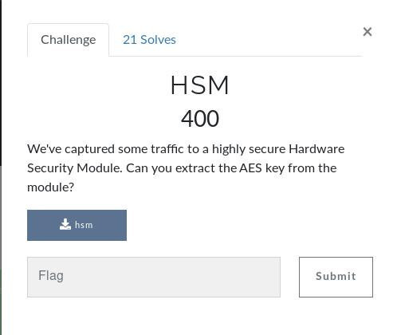
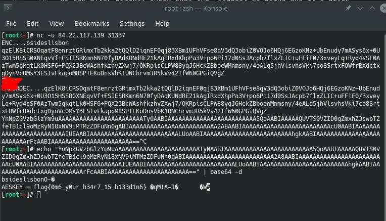

 # HSM

 In this challenge we know by the category it's a Pwn exercise.
It says:

> We've captured some traffic to a highly secure Hardware Security Module. Can you extract the AES key from the module?

## Inital Analysis

The file [HSM](Files/hsm) is given.

## Development

After analysing the file, we come to the conclusion that it's a pcap file, in which there a single UDP request:

We can after quickly check what the resquest is doing and it's given response.

__It's time to check it out__ 

We can quickly mimic the workflow described in the pcap file, firing up a terminal and typing the command

> nc -u 84.22.117.139 31337

After we use the ENC command, we can deduce almost instantly that there should be a DEC command, right?

__Of course!__

A close analysis reveals that the encryption sometimes leaks some strings it shouldn't...

We do this a couple of times, which will eventually result in a heart bleed, in which memory is leaked, and we can finally get the flag!